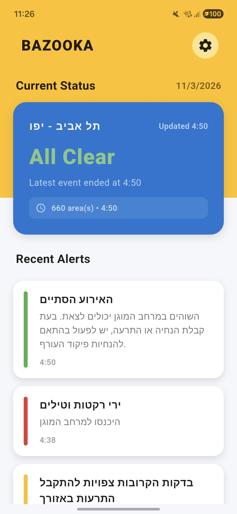
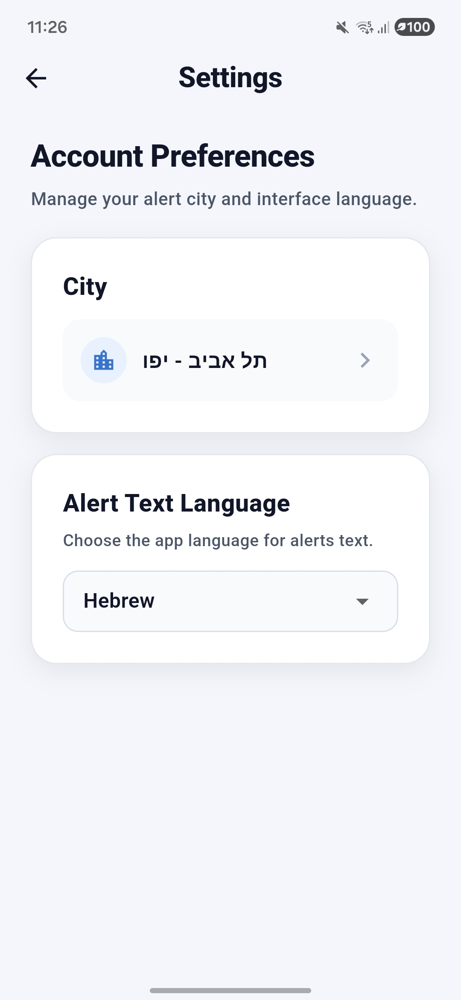
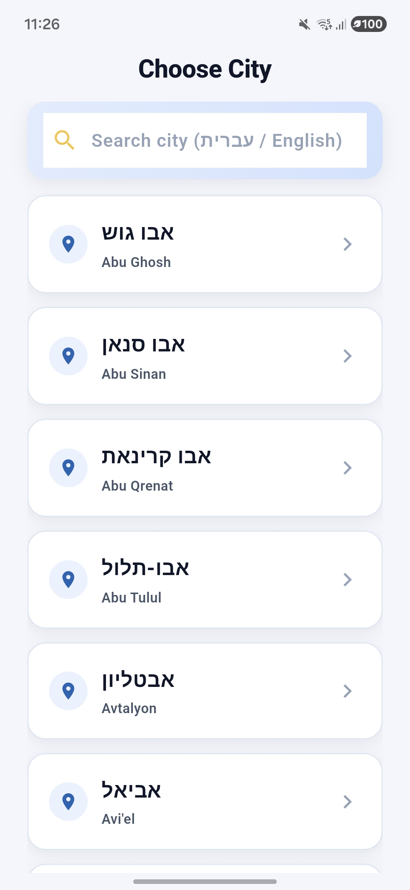

# Bazooka APP

Bazooka is a city-based Home Front alert app that uses the "Bazooka" song as its alert sound:

- `server/`: Node.js + Express + MongoDB backend that polls OREF and fans out FCM alerts.
- `app/`: Flutter Android app with city onboarding, recent alerts, settings, and popup notifications.

## Popup Demo

Popup flow assets are included under `docs/media/`.

### Screenshots

<p align="center">
  
  
  
</p>

### Screen Recording

Your markdown viewer may not support inline video playback.

- [Open popup recording with sound (MP4)](docs/media/popup-demo.mp4)
- [Download popup recording (MP4)](docs/media/popup-demo.mp4)

## Tech Stack

- Backend: Node.js 20+, TypeScript, Express, MongoDB, Firebase Admin SDK
- Mobile: Flutter (Android), Firebase Messaging, flutter_local_notifications

## Prerequisites

- Node.js 20+
- MongoDB running locally (`mongod`)
- Flutter SDK
- Firebase project and credentials:
  - `app/android/app/google-services.json`
  - `server/serviceAccountKey.json`

## Setup

### 1. Backend

```bash
cd server
npm install
cp .env.example .env
npm run lint
npm run build
npm run dev
```

Important backend env values (`server/.env`):

- `FCM_ENABLED=true`
- `FIREBASE_SERVICE_ACCOUNT_PATH=./serviceAccountKey.json`
- `DEV_TOOLS_ENABLED=true`

### 2. Android App

```bash
cd app
flutter pub get
cp .env.example .env
flutter analyze
flutter test
flutter run --dart-define=BACKEND_BASE_URL=http://10.0.2.2:3000
```

Firebase Android package name must match:

- `com.bazooka.alerts.app`

## Developer Testing

When backend is running, open:

- `http://127.0.0.1:3000/dev/tools`

Use this page to trigger test alerts (preset + custom) and verify popup behavior in the app.

## Server Deploy

For a server deploy, Bazooka can run as a single Docker container against MongoDB Atlas.

1. Create `server/server.env` on the server and set:

```env
PORT=3000
MONGO_URI=mongodb+srv://<username>:<password>@<cluster-url>/bazooka?retryWrites=true&w=majority

OREF_FEED_URL=https://www.oref.org.il/warningMessages/alert/Alerts.json
OREF_POLL_INTERVAL_MS=3000
OREF_REQUEST_TIMEOUT_MS=2000
OREF_POLLER_ENABLED=true
OREF_ALERTS_LOG_PATH=logs/oref-alerts.log
SYSTEM_LOG_PATH=logs/system.log

DEV_TOOLS_ENABLED=false

FCM_ENABLED=true
FIREBASE_SERVICE_ACCOUNT_PATH=/run/secrets/serviceAccountKey.json

WRITE_RATE_LIMIT_WINDOW_MS=60000
WRITE_RATE_LIMIT_MAX=120
```

2. Place the Firebase Admin SDK JSON at `server/serviceAccountKey.json`.
3. Start the backend:

```bash
docker compose -f docker-compose.server.yml up -d --build
```

4. Verify it locally on the server:

```bash
curl http://127.0.0.1:3000/health
docker compose -f docker-compose.server.yml logs -f server
```

5. Expose it through your existing Cloudflare Tunnel with a route like:

```text
bazooka-api.yourdomain.com -> http://127.0.0.1:3000
```

6. Update the app `BACKEND_BASE_URL` to the public HTTPS hostname before building a release.

## End-to-End Smoke Checklist

1. Register at least one device and city subscription (`/register-device`, `/subscription`).
2. Trigger a test alert from `/dev/tools`.
3. Confirm the app receives push and opens the popup with sound.
4. Confirm alerts list refreshes after push.
5. Confirm backend writes delivery and alert logs as expected.
